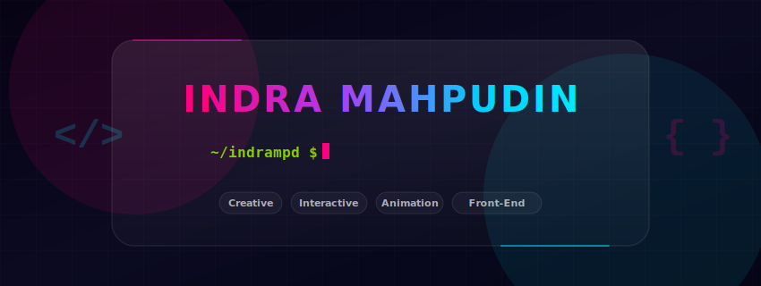

# ✨ Indra Mahpudin

### Creative Web Developer & Front-end Web Developer

> _"I believe motion is not just an ornament, but a language that guides the digital user experience."_

---

## 👨‍💻 `$ whoami`

👋 Hi, I'm **Indra Mahpudin**, a front-end developer specializing in creating high-performance, visually engaging, and highly interactive interfaces.

I combine modern JavaScript architecture with high-fidelity web motion tools like **GSAP**, **Three.js**, and **Webflow CMS** to turn complex designs into fluid, responsive front-end systems.

- 🔭 **Current Focus:** Performance tuning for mobile browsers, advanced canvas animations, and interactive scroll triggers.
- 🌱 **Currently Learning:** Three.js shader programming, WebGL performance optimization, and modern full-stack workflows.
- 💬 **Ask Me About:** GSAP animation tricks, Webflow custom code hacks, smooth scrolling setups (Lenis / Barba.js), and front-end performance tuning.

---

## 🛠️ `$ skills --list`

Querying local tech-stack repositories...

### ⚡ Core Tech & Languages

### 🌀 Motion, WebGL & Styling

### 🚀 Frameworks & Ecosystem

### 🛠️ Development & Cloud Tools

### 🎨 Creative & Design Tools

---

## 📬 `$ contact --ping`

Establish a communication channel via any of the following ports:

---

## 🚀 `$ ./'Featured Work & Web Experiments'`

A snapshot of my latest builds in creative frontend developments and motion layout systems.

| 🎨 Creative Web Animations | 🌀 Webflow Solutions |
| :--- | :--- |
| High-performance UI elements, custom scrolling timelines, and fluid micro-interactions developed using vanilla JS and **GSAP (GreenSock)**.  [**🔗 Explore Repositories →**](https://github.com/indrampd) | Fully custom Webflow layouts featuring robust styling, responsive systems, and custom javascript hooks embedded into Webflow CMS.  [**🔗 Explore Repositories →**](https://github.com/indrampd) |

---

## 📊 `$ ./'GitHub Analytics'`

| 📈 GitHub Streak | 🔤 Most Used Languages |
| :--- | :--- |
|  |  |

---

_Last Updated: 2026-07-23_
